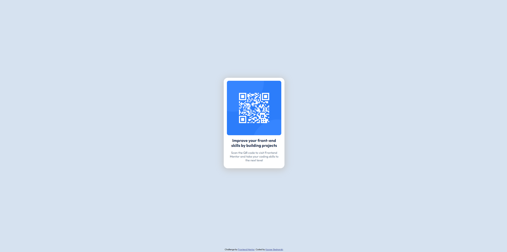

# Frontend Mentor - QR code component solution

This is a solution to the [QR code component challenge on Frontend Mentor](https://www.frontendmentor.io/challenges/qr-code-component-iux_sIO_H). Frontend Mentor challenges help you improve your coding skills by building realistic projects.

## Table of contents

- [Overview](#overview)
  - [Screenshot](#screenshot)
  - [Links](#links)
- [My process](#my-process)
  - [Built with](#built-with)
  - [What I learned](#what-i-learned)
  - [Continued development](#continued-development)
- [Author](#author)

## Overview

### Screenshot

### Links

- Solution URL: [Frontend Mentor](https://www.frontendmentor.io/solutions/qrcode-page-using-flexbox-s3yBPa2w4r)
- Live Site URL: [Netlify](https://dreamy-raindrop-ecd0b4.netlify.app/)

## My process

### Built with

- HTML
- CSS
- Flexbox

### What I learned

This was my first independent project. The biggest challenge I faced was positioning the footer at the bottom of the page. I learned how to properly structure a page layout using Flexbox to achieve this effect.

### Continued development

In the future, I would like to create full websites, both frontend and backend, to build more advanced and functional applications.

## Author

- Frontend Mentor - [Your Username](https://www.frontendmentor.io/profile/yourusername)
